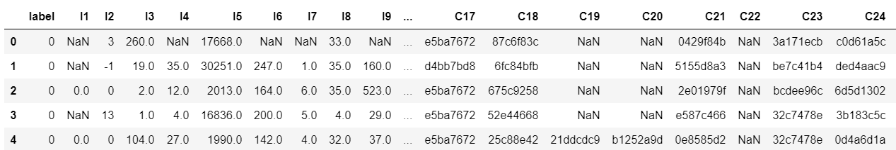
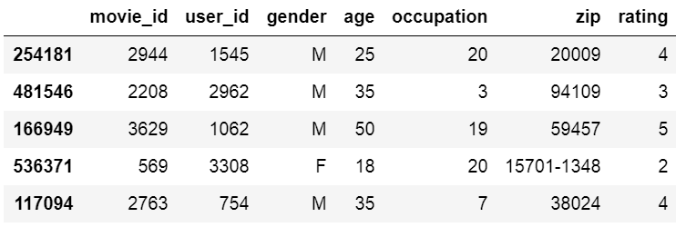
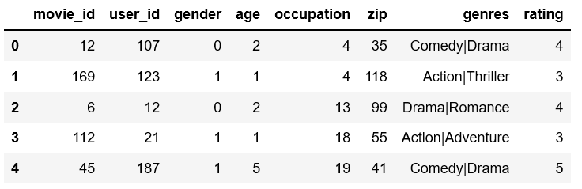

# Examples


## Classification: Criteo 

The Criteo Display Ads dataset is for the purpose of predicting ads 
click-through rate. It has 13 integer features and
26 categorical features where each category has a high cardinality.



In this example,we simply normailize the dense feature between 0 and 1,you
can try other transformation technique like log normalization or discretization.Then we use [SparseFeat](./Features.html#sparsefeat) and [DenseFeat](./Features.html#densefeat) to generate feature columns  for sparse features and dense features.


This example shows how to use ``DeepFM`` to solve a simple binary classification task. You can get the demo data [criteo_sample.txt](https://github.com/shenweichen/DeepCTR/tree/master/examples/criteo_sample.txt)
and run the following codes.

```python
import pandas as pd
from sklearn.metrics import log_loss, roc_auc_score
from sklearn.model_selection import train_test_split
from sklearn.preprocessing import LabelEncoder, MinMaxScaler

from deepctr.models import *
from deepctr.feature_column import SparseFeat, DenseFeat, get_feature_names

if __name__ == "__main__":
    data = pd.read_csv('./criteo_sample.txt')

    sparse_features = ['C' + str(i) for i in range(1, 27)]
    dense_features = ['I' + str(i) for i in range(1, 14)]

    data[sparse_features] = data[sparse_features].fillna('-1', )
    data[dense_features] = data[dense_features].fillna(0, )
    target = ['label']

    # 1.Label Encoding for sparse features,and do simple Transformation for dense features
    for feat in sparse_features:
        lbe = LabelEncoder()
        data[feat] = lbe.fit_transform(data[feat])
    mms = MinMaxScaler(feature_range=(0, 1))
    data[dense_features] = mms.fit_transform(data[dense_features])

    # 2.count #unique features for each sparse field,and record dense feature field name

    fixlen_feature_columns = [SparseFeat(feat, vocabulary_size=data[feat].nunique(),embedding_dim=4)
                           for i,feat in enumerate(sparse_features)] + [DenseFeat(feat, 1,)
                          for feat in dense_features]

    dnn_feature_columns = fixlen_feature_columns
    linear_feature_columns = fixlen_feature_columns

    feature_names = get_feature_names(linear_feature_columns + dnn_feature_columns)

    # 3.generate input data for model

    train, test = train_test_split(data, test_size=0.2, random_state=2020)
    train_model_input = {name:train[name] for name in feature_names}
    test_model_input = {name:test[name] for name in feature_names}

    # 4.Define Model,train,predict and evaluate
    model = DeepFM(linear_feature_columns, dnn_feature_columns, task='binary')
    model.compile("adam", "binary_crossentropy",
                  metrics=['binary_crossentropy'], )

    history = model.fit(train_model_input, train[target].values,
                        batch_size=256, epochs=10, verbose=2, validation_split=0.2, )
    pred_ans = model.predict(test_model_input, batch_size=256)
    print("test LogLoss", round(log_loss(test[target].values, pred_ans), 4))
    print("test AUC", round(roc_auc_score(test[target].values, pred_ans), 4))
```

## Classification: Criteo with feature hashing on the fly
This example shows how to use ``DeepFM`` to solve a simple binary classification task using feature hashing. You can get the demo data [criteo_sample.txt](https://github.com/shenweichen/DeepCTR/tree/master/examples/criteo_sample.txt)
and run the following codes.

```python
import pandas as pd
from sklearn.metrics import log_loss, roc_auc_score
from sklearn.model_selection import train_test_split
from sklearn.preprocessing import MinMaxScaler

from deepctr.models import DeepFM
from deepctr.feature_column import SparseFeat, DenseFeat,get_feature_names

if __name__ == "__main__":
    data = pd.read_csv('./criteo_sample.txt')

    sparse_features = ['C' + str(i) for i in range(1, 27)]
    dense_features = ['I' + str(i) for i in range(1, 14)]

    data[sparse_features] = data[sparse_features].fillna('-1', )
    data[dense_features] = data[dense_features].fillna(0, )
    target = ['label']

    # 1.do simple Transformation for dense features
    mms = MinMaxScaler(feature_range=(0, 1))
    data[dense_features] = mms.fit_transform(data[dense_features])

    # 2.set hashing space for each sparse field,and record dense feature field name

    fixlen_feature_columns = [SparseFeat(feat, vocabulary_size=1000,embedding_dim=4, use_hash=True, dtype='string')  # since the input is string
                              for feat in sparse_features] + [DenseFeat(feat, 1, )
                          for feat in dense_features]

    linear_feature_columns = fixlen_feature_columns
    dnn_feature_columns = fixlen_feature_columns
    feature_names = get_feature_names(linear_feature_columns + dnn_feature_columns, )

    # 3.generate input data for model

    train, test = train_test_split(data, test_size=0.2, random_state=2020)

    train_model_input = {name:train[name] for name in feature_names}
    test_model_input = {name:test[name] for name in feature_names}


    # 4.Define Model,train,predict and evaluate
    model = DeepFM(linear_feature_columns,dnn_feature_columns, task='binary')
    model.compile("adam", "binary_crossentropy",
                  metrics=['binary_crossentropy'], )

    history = model.fit(train_model_input, train[target].values,
                        batch_size=256, epochs=10, verbose=2, validation_split=0.2, )
    pred_ans = model.predict(test_model_input, batch_size=256)
    print("test LogLoss", round(log_loss(test[target].values, pred_ans), 4))
    print("test AUC", round(roc_auc_score(test[target].values, pred_ans), 4))

```
## Regression: Movielens

The MovieLens data has been used for personalized tag recommendation,which
contains 668, 953 tag applications of users on movies.
Here is a small fraction of data include  only sparse field.




This example shows how to use ``DeepFM`` to solve a simple binary regression task. You can get the demo data 
[movielens_sample.txt](https://github.com/shenweichen/DeepCTR/tree/master/examples/movielens_sample.txt) and run the following codes.

```python
import pandas as pd
from sklearn.metrics import mean_squared_error
from sklearn.model_selection import train_test_split
from sklearn.preprocessing import LabelEncoder

from deepctr.models import DeepFM
from deepctr.feature_column import SparseFeat,get_feature_names

if __name__ == "__main__":

    data = pd.read_csv("./movielens_sample.txt")
    sparse_features = ["movie_id", "user_id",
                       "gender", "age", "occupation", "zip"]
    target = ['rating']

    # 1.Label Encoding for sparse features,and do simple Transformation for dense features
    for feat in sparse_features:
        lbe = LabelEncoder()
        data[feat] = lbe.fit_transform(data[feat])
    # 2.count #unique features for each sparse field
    fixlen_feature_columns = [SparseFeat(feat, data[feat].nunique(),embedding_dim=4)
                              for feat in sparse_features]
    linear_feature_columns = fixlen_feature_columns
    dnn_feature_columns = fixlen_feature_columns
    feature_names = get_feature_names(linear_feature_columns + dnn_feature_columns)

    # 3.generate input data for model
    train, test = train_test_split(data, test_size=0.2, random_state=2020)
    train_model_input = {name:train[name].values for name in feature_names}
    test_model_input = {name:test[name].values for name in feature_names}

    # 4.Define Model,train,predict and evaluate
    model = DeepFM(linear_feature_columns, dnn_feature_columns, task='regression')
    model.compile("adam", "mse", metrics=['mse'], )

    history = model.fit(train_model_input, train[target].values,
                        batch_size=256, epochs=10, verbose=2, validation_split=0.2, )
    pred_ans = model.predict(test_model_input, batch_size=256)
    print("test MSE", round(mean_squared_error(
        test[target].values, pred_ans), 4))


```
## Multi-value Input : Movielens
----------------------------------

The MovieLens data has been used for personalized tag recommendation,which
contains 668, 953 tag applications of users on movies.
Here is a small fraction of data include  sparse fields and a multivalent field.



There are 2 additional steps to use DeepCTR with sequence feature input.

1. Generate the paded and encoded sequence feature  of sequence input feature(**value 0 is for padding**).
2. Generate config of sequence feature with [VarLenSparseFeat](./Features.html#varlensparsefeat)


This example shows how to use ``DeepFM`` with sequence(multi-value) feature. You can get the demo data 
[movielens_sample.txt](https://github.com/shenweichen/DeepCTR/tree/master/examples/movielens_sample.txt) and run the following codes.

```python
import numpy as np
import pandas as pd
from sklearn.preprocessing import LabelEncoder
from tensorflow.python.keras.preprocessing.sequence import pad_sequences

from deepctr.models import DeepFM
from deepctr.feature_column import SparseFeat, VarLenSparseFeat,get_feature_names


def split(x):
    key_ans = x.split('|')
    for key in key_ans:
        if key not in key2index:
            # Notice : input value 0 is a special "padding",so we do not use 0 to encode valid feature for sequence input
            key2index[key] = len(key2index) + 1
    return list(map(lambda x: key2index[x], key_ans))

if __name__ == "__main__":
    data = pd.read_csv("./movielens_sample.txt")
    sparse_features = ["movie_id", "user_id",
                       "gender", "age", "occupation", "zip", ]
    target = ['rating']

    # 1.Label Encoding for sparse features,and process sequence features
    for feat in sparse_features:
        lbe = LabelEncoder()
        data[feat] = lbe.fit_transform(data[feat])
    # preprocess the sequence feature

    key2index = {}
    genres_list = list(map(split, data['genres'].values))
    genres_length = np.array(list(map(len, genres_list)))
    max_len = max(genres_length)
    # Notice : padding=`post`
    genres_list = pad_sequences(genres_list, maxlen=max_len, padding='post', )

    # 2.count #unique features for each sparse field and generate feature config for sequence feature

    fixlen_feature_columns = [SparseFeat(feat, data[feat].nunique(),embedding_dim=4)
                        for feat in sparse_features]

    use_weighted_sequence = False
    if use_weighted_sequence:
        varlen_feature_columns = [VarLenSparseFeat(SparseFeat('genres',vocabulary_size=len(
            key2index) + 1,embedding_dim=4), maxlen= max_len, combiner='mean',weight_name='genres_weight')]  # Notice : value 0 is for padding for sequence input feature
    else:
        varlen_feature_columns = [VarLenSparseFeat(SparseFeat('genres',vocabulary_size= len(
            key2index) + 1,embedding_dim=4), maxlen=max_len, combiner='mean',weight_name=None)]  # Notice : value 0 is for padding for sequence input feature

    linear_feature_columns = fixlen_feature_columns + varlen_feature_columns
    dnn_feature_columns = fixlen_feature_columns + varlen_feature_columns

    feature_names = get_feature_names(linear_feature_columns+dnn_feature_columns)


    # 3.generate input data for model
    model_input = {name:data[name] for name in feature_names}#
    model_input["genres"] = genres_list
    model_input["genres_weight"] =  np.random.randn(data.shape[0],max_len,1)


    # 4.Define Model,compile and train
    model = DeepFM(linear_feature_columns,dnn_feature_columns,task='regression')

    model.compile("adam", "mse", metrics=['mse'], )
    history = model.fit(model_input, data[target].values,
                        batch_size=256, epochs=10, verbose=2, validation_split=0.2, )
```

## Multi-value Input : Movielens with feature hashing on the fly
----------------------------------
```python
import numpy as np
import pandas as pd
from tensorflow.python.keras.preprocessing.sequence import pad_sequences

from deepctr.feature_column import SparseFeat, VarLenSparseFeat,get_feature_names
from deepctr.models import DeepFM

if __name__ == "__main__":
    data = pd.read_csv("./movielens_sample.txt")
    sparse_features = ["movie_id", "user_id",
                       "gender", "age", "occupation", "zip", ]

    data[sparse_features] = data[sparse_features].astype(str)
    target = ['rating']

    # 1.Use hashing encoding on the fly for sparse features,and process sequence features

    genres_list = list(map(lambda x: x.split('|'), data['genres'].values))
    genres_length = np.array(list(map(len, genres_list)))
    max_len = max(genres_length)

    # Notice : padding=`post`
    genres_list = pad_sequences(genres_list, maxlen=max_len, padding='post', dtype=str, value=0)

    # 2.set hashing space for each sparse field and generate feature config for sequence feature

    fixlen_feature_columns = [SparseFeat(feat, data[feat].nunique() * 5, embedding_dim=4, use_hash=True, dtype='string')
                              for feat in sparse_features]
    varlen_feature_columns = [
        VarLenSparseFeat(SparseFeat('genres', vocabulary_size=100, embedding_dim=4, use_hash=True, dtype="string"),
                         maxlen=max_len, combiner='mean',
                         )]  # Notice : value 0 is for padding for sequence input feature
    linear_feature_columns = fixlen_feature_columns + varlen_feature_columns
    dnn_feature_columns = fixlen_feature_columns + varlen_feature_columns
    feature_names = get_feature_names(linear_feature_columns + dnn_feature_columns)

    # 3.generate input data for model
    model_input = {name: data[name] for name in feature_names}
    model_input['genres'] = genres_list

    # 4.Define Model,compile and train
    model = DeepFM(linear_feature_columns, dnn_feature_columns, task='regression')

    model.compile("adam", "mse", metrics=['mse'], )
    history = model.fit(model_input, data[target].values,
                        batch_size=256, epochs=10, verbose=2, validation_split=0.2, )
```

## Estimator with TFRecord: Classification Criteo 

This example shows how to use ``DeepFMEstimator`` to solve a simple binary classification task. You can get the demo data [criteo_sample.tr.tfrecords](https://github.com/shenweichen/DeepCTR/tree/master/examples/criteo_sample.tr.tfrecords) and [criteo_sample.te.tfrecords](https://github.com/shenweichen/DeepCTR/tree/master/examples/criteo_sample.te.tfrecords)
and run the following codes.

```python
import tensorflow as tf

from tensorflow.python.ops.parsing_ops import  FixedLenFeature
from deepctr.estimator import DeepFMEstimator
from deepctr.estimator.inputs import input_fn_tfrecord


if __name__ == "__main__":

    # 1.generate feature_column for linear part and dnn part

    sparse_features = ['C' + str(i) for i in range(1, 27)]
    dense_features = ['I' + str(i) for i in range(1, 14)]

    dnn_feature_columns = []
    linear_feature_columns = []

    for i, feat in enumerate(sparse_features):
        dnn_feature_columns.append(tf.feature_column.embedding_column(
            tf.feature_column.categorical_column_with_identity(feat, 1000), 4))
        linear_feature_columns.append(tf.feature_column.categorical_column_with_identity(feat, 1000))
    for feat in dense_features:
        dnn_feature_columns.append(tf.feature_column.numeric_column(feat))
        linear_feature_columns.append(tf.feature_column.numeric_column(feat))

    # 2.generate input data for model

    feature_description = {k: FixedLenFeature(dtype=tf.int64, shape=1) for k in sparse_features}
    feature_description.update(
        {k: FixedLenFeature(dtype=tf.float32, shape=1) for k in dense_features})
    feature_description['label'] = FixedLenFeature(dtype=tf.float32, shape=1)

    train_model_input = input_fn_tfrecord('./criteo_sample.tr.tfrecords', feature_description, 'label', batch_size=256,
                                          num_epochs=1, shuffle_factor=10)
    test_model_input = input_fn_tfrecord('./criteo_sample.te.tfrecords', feature_description, 'label',
                                         batch_size=2 ** 14, num_epochs=1, shuffle_factor=0)

    # 3.Define Model,train,predict and evaluate
    model = DeepFMEstimator(linear_feature_columns, dnn_feature_columns, task='binary')

    model.train(train_model_input)
    eval_result = model.evaluate(test_model_input)

    print(eval_result)

```

## Estimator with Pandas DataFrame: Classification Criteo 
This example shows how to use ``DeepFMEstimator`` to solve a simple binary classification task. You can get the demo data [criteo_sample.txt](https://github.com/shenweichen/DeepCTR/tree/master/examples/criteo_sample.txt)
and run the following codes.

```python
import pandas as pd
import tensorflow as tf
from sklearn.metrics import log_loss, roc_auc_score
from sklearn.model_selection import train_test_split
from sklearn.preprocessing import LabelEncoder, MinMaxScaler

from deepctr.estimator import DeepFMEstimator
from deepctr.estimator.inputs import input_fn_pandas

if __name__ == "__main__":
    data = pd.read_csv('./criteo_sample.txt')

    sparse_features = ['C' + str(i) for i in range(1, 27)]
    dense_features = ['I' + str(i) for i in range(1, 14)]

    data[sparse_features] = data[sparse_features].fillna('-1', )
    data[dense_features] = data[dense_features].fillna(0, )
    target = ['label']

    # 1.Label Encoding for sparse features,and do simple Transformation for dense features
    for feat in sparse_features:
        lbe = LabelEncoder()
        data[feat] = lbe.fit_transform(data[feat])
    mms = MinMaxScaler(feature_range=(0, 1))
    data[dense_features] = mms.fit_transform(data[dense_features])

    # 2.count #unique features for each sparse field,and record dense feature field name

    dnn_feature_columns = []
    linear_feature_columns = []

    for i, feat in enumerate(sparse_features):
        dnn_feature_columns.append(tf.feature_column.embedding_column(
            tf.feature_column.categorical_column_with_identity(feat, data[feat].nunique()), 4))
        linear_feature_columns.append(tf.feature_column.categorical_column_with_identity(feat, data[feat].nunique()))
    for feat in dense_features:
        dnn_feature_columns.append(tf.feature_column.numeric_column(feat))
        linear_feature_columns.append(tf.feature_column.numeric_column(feat))

    # 3.generate input data for model

    train, test = train_test_split(data, test_size=0.2, random_state=2020)

    # Not setting default value for continuous feature. filled with mean.

    train_model_input = input_fn_pandas(train, sparse_features + dense_features, 'label', shuffle=True)
    test_model_input = input_fn_pandas(test, sparse_features + dense_features, None, shuffle=False)

    # 4.Define Model,train,predict and evaluate
    model = DeepFMEstimator(linear_feature_columns, dnn_feature_columns, task='binary')

    model.train(train_model_input)
    pred_ans_iter = model.predict(test_model_input)
    pred_ans = list(map(lambda x: x['pred'], pred_ans_iter))
    #
    print("test LogLoss", round(log_loss(test[target].values, pred_ans), 4))
    print("test AUC", round(roc_auc_score(test[target].values, pred_ans), 4))

```