# Features

## Overview

With the great success of deep learning,DNN-based techniques have been widely used in CTR prediction task.

DNN based CTR prediction models usually have following 4 modules:
`Input,Embedding,Low-order&High-order Feature Extractor,Prediction`

- Input&Embedding
>  The  data in CTR estimation task  usually includes high sparse,high cardinality 
  categorical features  and some dense numerical features.  

>  Since DNN are good at handling dense numerical features,we usually map the sparse categorical 
  features to dense numerical through `embedding technique`.  

 > For numerical features,we usually apply `discretization` or `normalization` on them.

- Feature Extractor
 > Low-order Extractor learns feature interaction through  product between vectors.Factorization-Machine and it's variants are widely used to learn the low-order feature interaction.

 > High-order Extractor learns feature combination through complex neural network functions like MLP,Cross Net,etc.

## Feature Columns
### SparseFeat
``SparseFeat`` is a namedtuple with signature ``SparseFeat(name, vocabulary_size, embedding_dim, use_hash, dtype, embeddings_initializer, embedding_name, group_name, trainable)``

- name : feature name
- vocabulary_size : number of unique feature values for sprase feature or hashing space when `use_hash=True`
- embedding_dim : embedding dimension
- use_hash : defualt `False`.If `True` the input will be hashed to space of size `vocabulary_size`.
- dtype : default `float32`.dtype of input tensor.
- embeddings_initializer : initializer for the `embeddings` matrix.
- embedding_name : default `None`. If None, the embedding_name will be same as `name`.
- group_name : feature group of this feature.
- trainable: default `True`.Whether or not the embedding is trainable.

### DenseFeat
``DenseFeat`` is a namedtuple with signature ``DenseFeat(name, dimension, dtype)``

- name : feature name
- dimension : dimension of dense feature vector.
- dtype : default `float32`.dtype of input tensor.

### VarLenSparseFeat

``VarLenSparseFeat`` is a namedtuple with signature ``VarLenSparseFeat(sparsefeat, maxlen, combiner, length_name, weight_name,weight_norm)``

- sparsefeat : a instance of `SparseFeat`
- maxlen : maximum length of this feature for all samples
- combiner : pooling method,can be ``sum``,``mean`` or ``max``
- length_name : feature length name,if `None`, value 0 in feature is for padding.
- weight_name : default `None`. If not None, the sequence feature will be multiplyed by the feature whose name is `weight_name`.
- weight_norm : default `True`. Whether normalize the weight score or not.

## Models

### CCPM (Convolutional Click Prediction Model)

CCPM can extract local-global key features from an input instance with varied elements, which can be implemented for not only single ad impression but also sequential ad impression. 

[**CCPM Model API**](./deepctr.models.ccpm.html)
[**CCPM Estimator API**](./deepctr.estimator.models.ccpm.html)

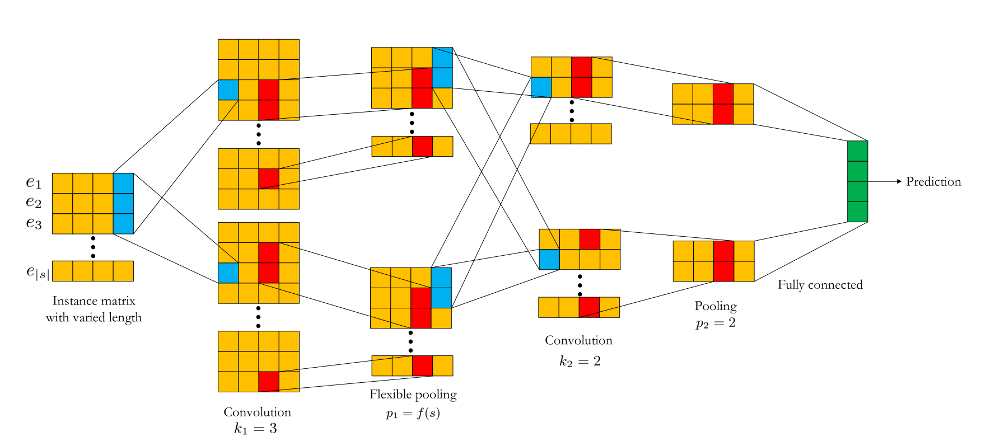

[Liu Q, Yu F, Wu S, et al. A convolutional click prediction model[C]//Proceedings of the 24th ACM International on Conference on Information and Knowledge Management. ACM, 2015: 1743-1746.](http://ir.ia.ac.cn/bitstream/173211/12337/1/A%20Convolutional%20Click%20Prediction%20Model.pdf) 

### FNN (Factorization-supported Neural Network)

According to the paper,FNN learn embedding vectors of categorical data via pre-trained FM.
It use FM's latent vector to initialiaze the embedding vectors.During the training stage,it 
concatenates the embedding vectors and feeds them into a MLP(MultiLayer Perceptron). 

[**FNN Model API**](./deepctr.models.fnn.html)
[**FNN Estimator API**](./deepctr.estimator.models.fnn.html)

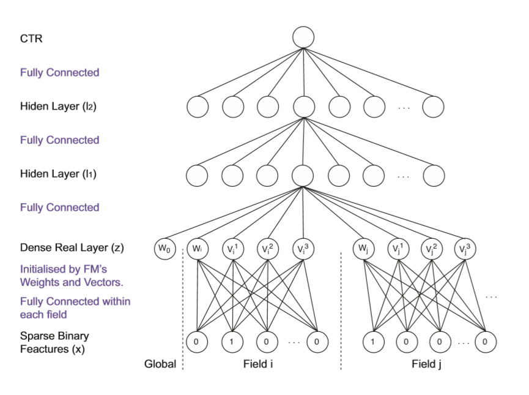

[Zhang W, Du T, Wang J. Deep learning over multi-field categorical data[C]//European conference on information retrieval. Springer, Cham, 2016: 45-57.](https://arxiv.org/pdf/1601.02376.pdf)

### PNN (Product-based Neural Network)

PNN concatenates sparse feature embeddings and the product between  embedding vectors as the input of MLP. 

[**PNN Model API**](./deepctr.models.pnn.html)
[**PNN Estimator API**](./deepctr.estimator.models.pnn.html)

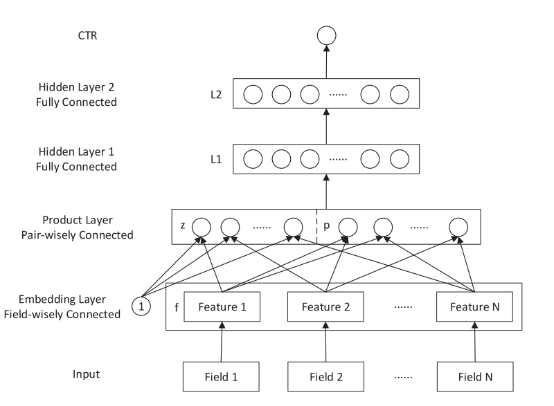

[Qu Y, Cai H, Ren K, et al. Product-based neural networks for user response prediction[C]//Data Mining (ICDM), 2016 IEEE 16th International Conference on. IEEE, 2016: 1149-1154.](https://arxiv.org/pdf/1611.00144.pdf)

### Wide & Deep

WDL's deep part concatenates sparse feature embeddings as the input of MLP,the wide part use handcrafted feature as input.
The logits of deep part and wide part are added to get the prediction probability.

[**WDL Model API**](./deepctr.models.wdl.html)
[**WDL Estimator API**](./deepctr.estimator.models.wdl.html)

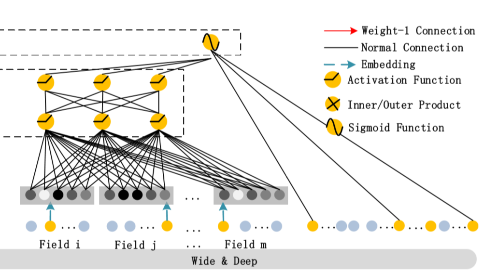

[Cheng H T, Koc L, Harmsen J, et al. Wide & deep learning for recommender systems[C]//Proceedings of the 1st Workshop on Deep Learning for Recommender Systems. ACM, 2016: 7-10.](https://arxiv.org/pdf/1606.07792.pdf)

### DeepFM

DeepFM can be seen as an improvement of WDL and FNN.Compared with WDL,DeepFM use
FM instead of LR in the wide part and use concatenation of embedding vectors as the input of MLP in the deep part.
Compared with FNN,the embedding vector of FM and input to MLP are same.
And they do not need a FM pretrained vector to initialiaze,they are learned end2end. 

[**DeepFM Model API**](./deepctr.models.deepfm.html)
[**DeepFM Estimator API**](./deepctr.estimator.models.deepfm.html)

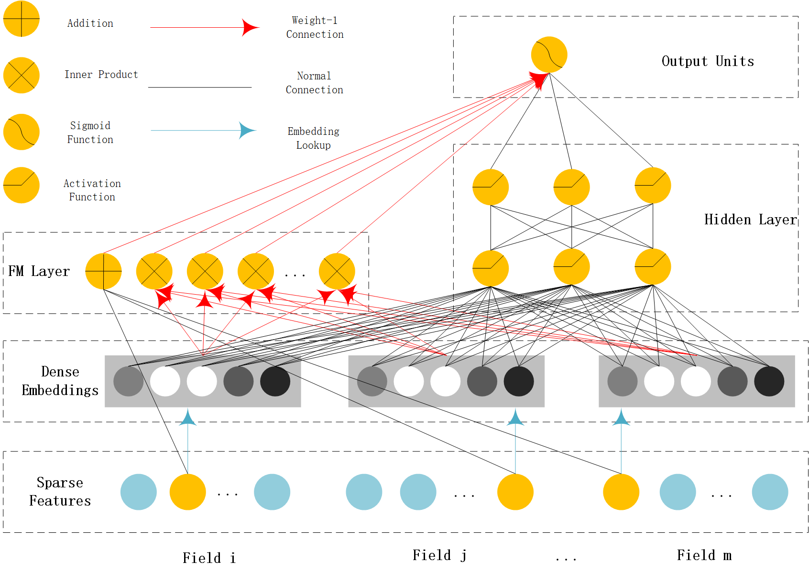

[Guo H, Tang R, Ye Y, et al. Deepfm: a factorization-machine based neural network for ctr prediction[J]. arXiv preprint arXiv:1703.04247, 2017.](http://www.ijcai.org/proceedings/2017/0239.pdf)

### MLR(Mixed Logistic Regression/Piece-wise Linear Model)

MLR can be viewed as a combination of $2m$ LR model, $m$  is the piece(region) number.
$m$ LR model learns the weight that the sample belong to each region,another m LR model learn sample's click probability in the region.
Finally,the sample's CTR is a weighted sum of each region's click probability.Notice the weight is normalized weight.

[**MLR Model API**](./deepctr.models.mlr.html)

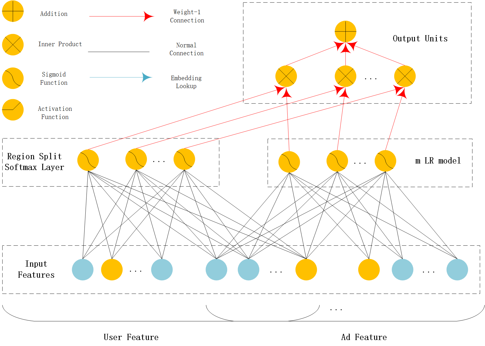

[Gai K, Zhu X, Li H, et al. Learning Piece-wise Linear Models from Large Scale Data for Ad Click Prediction[J]. arXiv preprint arXiv:1704.05194, 2017.](http://arxiv.org/abs/1704.05194)

### NFM (Neural Factorization Machine)

NFM use a bi-interaction pooling layer to learn feature interaction between
embedding vectors and compress the result into a singe vector which has the same size as a single embedding vector.
And then fed it into a MLP.The output logit of MLP and the output logit of linear part are added to get the prediction probability. 

[**NFM Model API**](./deepctr.models.nfm.html)
[**NFM Estimator API**](./deepctr.estimator.models.nfm.html)

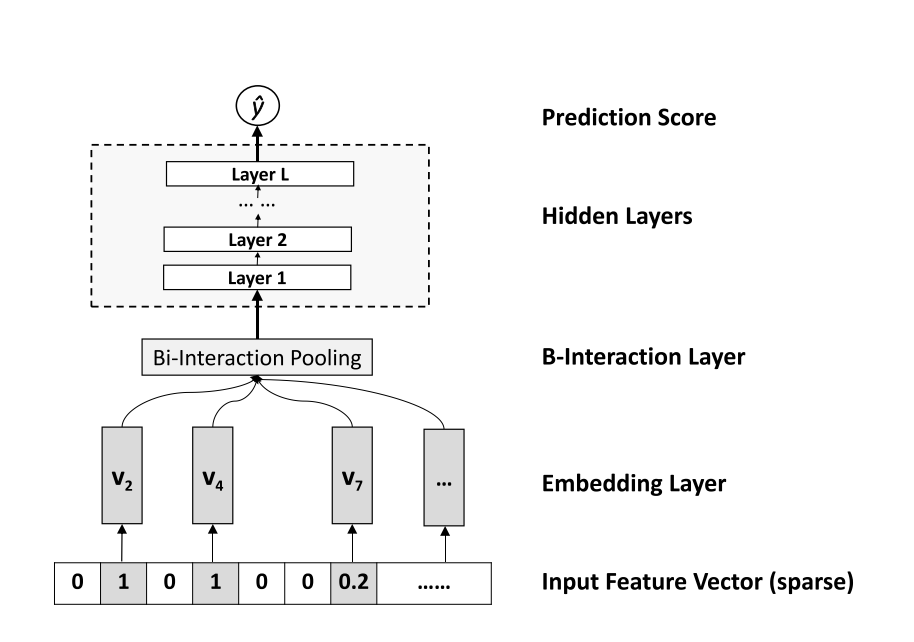

[He X, Chua T S. Neural factorization machines for sparse predictive analytics[C]//Proceedings of the 40th International ACM SIGIR conference on Research and Development in Information Retrieval. ACM, 2017: 355-364.](https://arxiv.org/pdf/1708.05027.pdf)

### AFM (Attentional Factorization Machine)

AFM is a variant of FM,tradional FM sums the inner product of embedding vector uniformly.
AFM can be seen as weighted sum of feature interactions.The weight is learned by a small MLP. 

[**AFM Model API**](./deepctr.models.afm.html)
[**AFM Estimator API**](./deepctr.estimator.models.afm.html)

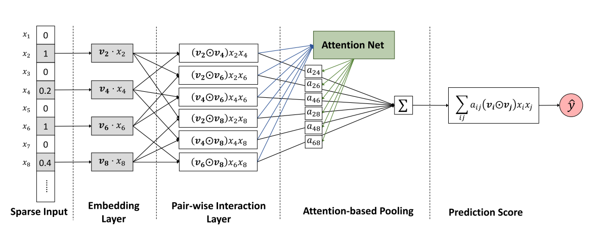

[Xiao J, Ye H, He X, et al. Attentional factorization machines: Learning the weight of feature interactions via attention networks[J]. arXiv preprint arXiv:1708.04617, 2017.](http://www.ijcai.org/proceedings/2017/435)

### DCN (Deep & Cross Network)

DCN use a Cross Net to learn both low and high order feature interaction explicitly,and use a MLP to learn feature interaction implicitly.
The output of Cross Net and MLP are concatenated.The concatenated vector are feed into one fully connected layer to get the prediction probability. 

[**DCN Model API**](./deepctr.models.dcn.html)
[**DCN Estimator API**](./deepctr.estimator.models.dcn.html)

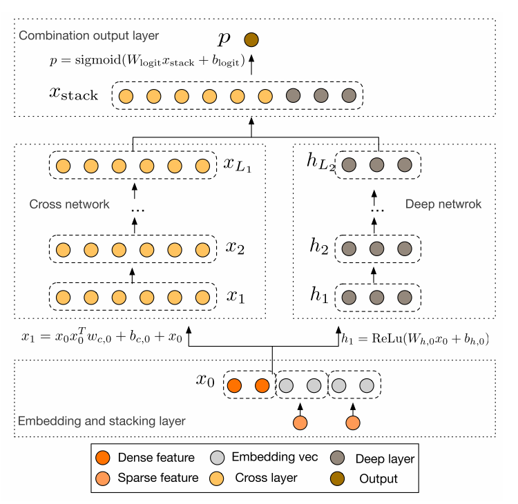

[Wang R, Fu B, Fu G, et al. Deep & cross network for ad click predictions[C]//Proceedings of the ADKDD'17. ACM, 2017: 12.](https://arxiv.org/abs/1708.05123) 

### DIN (Deep Interest Network)

DIN introduce a attention method to learn from sequence(multi-valued) feature.
Tradional method usually use sum/mean pooling on sequence feature.
DIN use a local activation unit to get the activation score between candidate item and history items.
User's interest are represented by weighted sum of user behaviors.
user's interest vector and other embedding vectors are concatenated and fed into a MLP to get the prediction. 

[**DIN Model API**](./deepctr.models.din.html)  

[DIN example](https://github.com/shenweichen/DeepCTR/tree/master/examples/run_din.py)

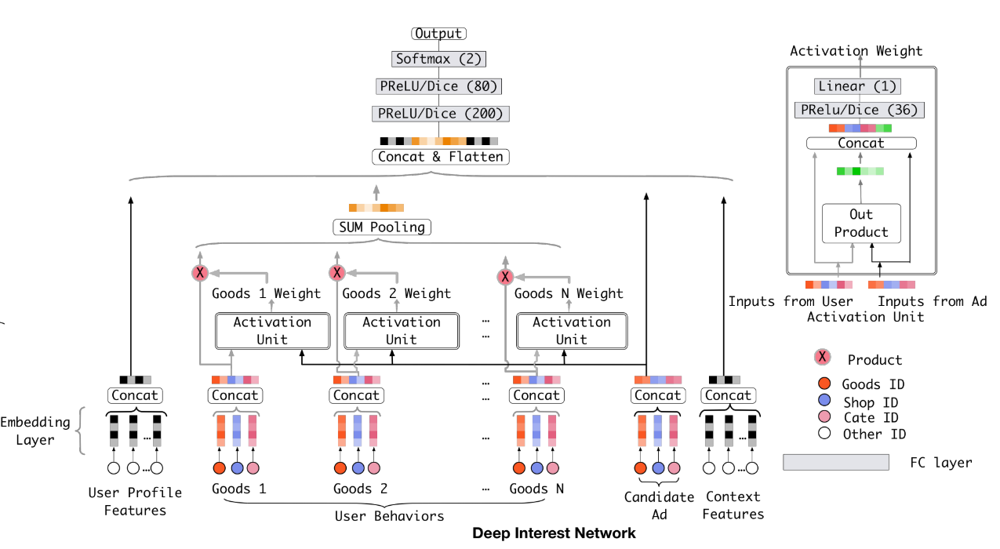

[Zhou G, Zhu X, Song C, et al. Deep interest network for click-through rate prediction[C]//Proceedings of the 24th ACM SIGKDD International Conference on Knowledge Discovery & Data Mining. ACM, 2018: 1059-1068.](https://arxiv.org/pdf/1706.06978.pdf)

### DIEN (Deep Interest Evolution Network)

Deep Interest Evolution Network (DIEN) uses interest extractor layer to capture temporal interests from history behavior sequence. At this layer,  an auxiliary loss is proposed to supervise interest extracting at each step. As user interests are diverse, especially in the e-commerce system, interest evolving layer is proposed to capture interest evolving process that is relative to the target item. At interest evolving layer, attention mechanism is embedded into the sequential structure novelly, and the effects of relative interests are strengthened during interest evolution.

[**DIEN Model API**](./deepctr.models.dien.html) 

[DIEN example](https://github.com/shenweichen/DeepCTR/tree/master/examples/run_dien.py)

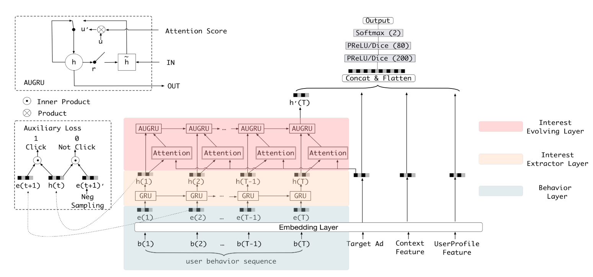

[Zhou G, Mou N, Fan Y, et al. Deep Interest Evolution Network for Click-Through Rate Prediction[J]. arXiv preprint arXiv:1809.03672, 2018.](https://arxiv.org/pdf/1809.03672.pdf)

### xDeepFM

xDeepFM use a Compressed Interaction Network (CIN) to learn both low and high order feature interaction explicitly,and use a MLP to learn feature interaction implicitly.
In each layer of CIN,first compute outer products between $x^k$ and $x_0$ to get a tensor $Z_{k+1}$,then use a 1DConv to learn feature maps $H_{k+1}$ on this tensor.
Finally,apply sum pooling on all the feature maps $H_k$ to get one vector.The vector is used to compute the logit that CIN contributes.

[**xDeepFM Model API**](./deepctr.models.xdeepfm.html)
[**xDeepFM Estimator API**](./deepctr.estimator.models.xdeepfn.html)

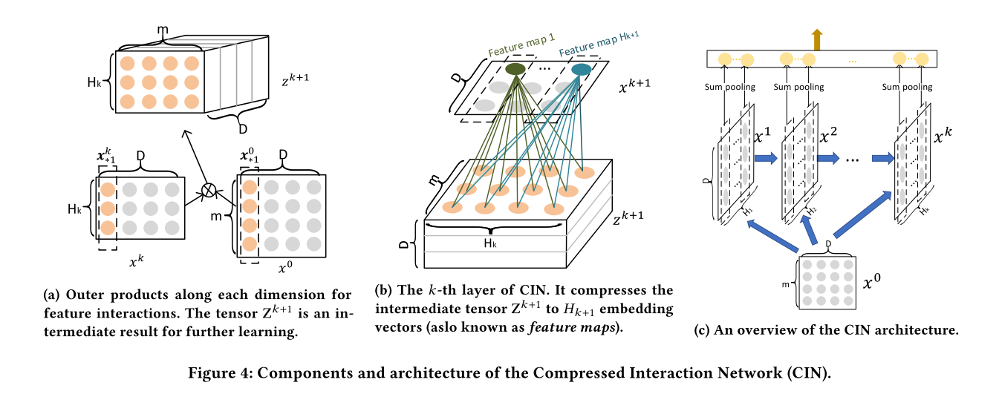

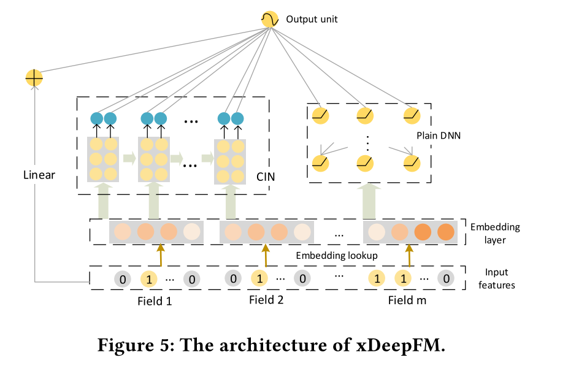

[Lian J, Zhou X, Zhang F, et al. xDeepFM: Combining Explicit and Implicit Feature Interactions for Recommender Systems[J]. arXiv preprint arXiv:1803.05170, 2018.](https://arxiv.org/pdf/1803.05170.pdf)

### AutoInt(Automatic Feature Interaction)

AutoInt use a interacting layer to model the interactions between different features.
Within each interacting layer, each feature is allowed to interact with all the other features and is able to automatically identify relevant features to form meaningful higher-order features via the multi-head attention mechanism.
By stacking multiple interacting layers,AutoInt is able to model different orders of feature interactions. 

[**AutoInt Model API**](./deepctr.models.autoint.html)
[**AutoInt Estimator API**](./deepctr.estimator.models.autoint.html)

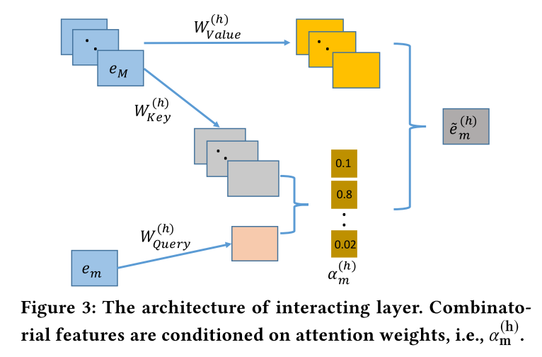

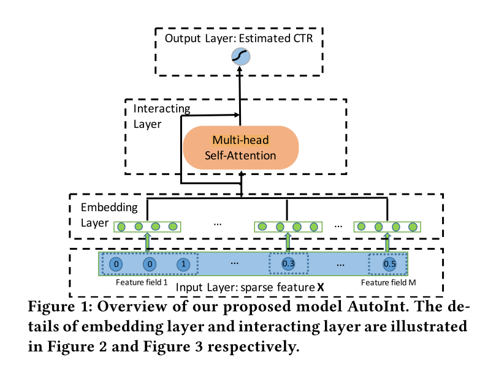

[Song W, Shi C, Xiao Z, et al. AutoInt: Automatic Feature Interaction Learning via Self-Attentive Neural Networks[J]. arXiv preprint arXiv:1810.11921, 2018.](https://arxiv.org/abs/1810.11921)

### ONN(Operation-aware Neural Networks for User Response Prediction)

ONN models second order feature interactions like like FFM and preserves second-order interaction information  as much as possible.Further more,deep neural network is used to learn higher-ordered feature interactions. 

[**ONN Model API**](./deepctr.models.onn.html)

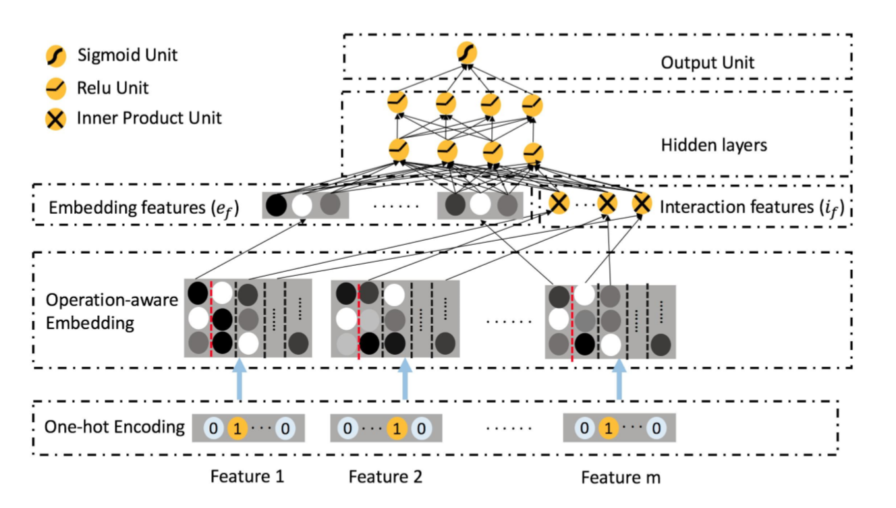

[Yang Y, Xu B, Shen F, et al. Operation-aware Neural Networks for User Response Prediction[J]. arXiv preprint arXiv:1904.12579, 2019.](https://arxiv.org/pdf/1904.12579.pdf)

### FGCNN(Feature Generation by Convolutional Neural Network)

FGCNN models with two components: Feature Generation and Deep Classifier. Feature Generation leverages the strength of CNN to generate local patterns and recombine them to generate new features. Deep Classifier adopts the structure of IPNN to learn interactions from the augmented feature space.

[**FGCNN Model API**](./deepctr.models.fgcnn.html)

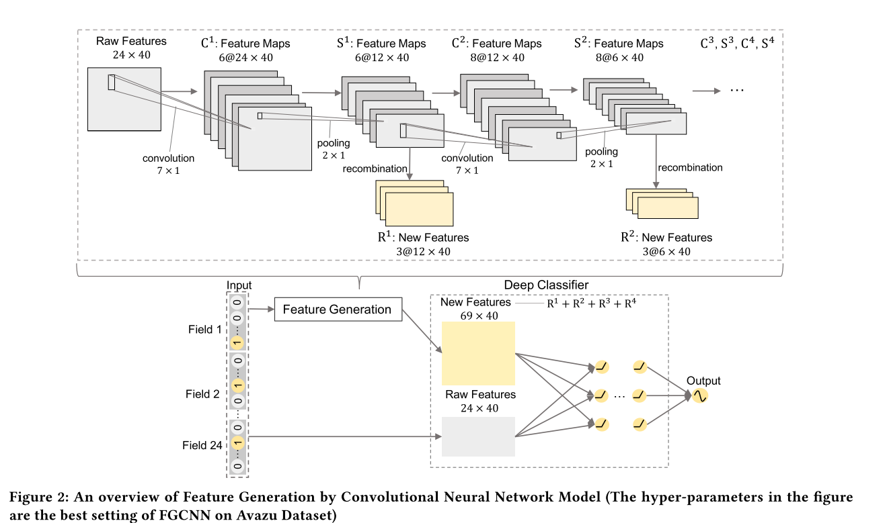

[Liu B, Tang R, Chen Y, et al. Feature Generation by Convolutional Neural Network for Click-Through Rate Prediction[J]. arXiv preprint arXiv:1904.04447, 2019.](https://arxiv.org/pdf/1904.04447)

### DSIN(Deep Session Interest  Network)

Deep Session Interest Network (DSIN) extracts users' multiple historical sessions in their behavior sequences. First it uses self-attention mechanism with bias encoding to extract users' interests in each session. Then apply Bi-LSTM to model how users' interests evolve and interact among sessions. Finally, local activation unit is used to adaptively learn the influences of various session interests on the target item. 

[**DSIN Model API**](./deepctr.models.dsin.html)  

[DSIN example](https://github.com/shenweichen/DeepCTR/tree/master/examples/run_dsin.py)

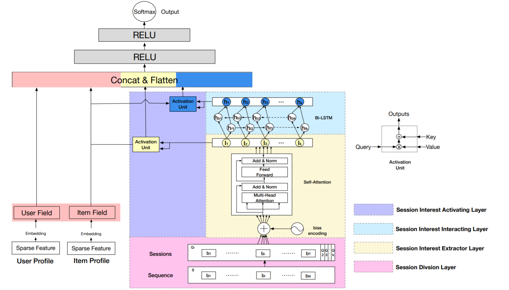

[Feng Y, Lv F, Shen W, et al. Deep Session Interest Network for Click-Through Rate Prediction[J]. arXiv preprint arXiv:1905.06482, 2019.](https://arxiv.org/abs/1905.06482)

### FiBiNET(Feature Importance and Bilinear feature Interaction NETwork)

Feature Importance and Bilinear feature Interaction NETwork is proposed to dynamically learn the feature importance and fine-grained feature interactions. On the one hand, the FiBiNET can dynamically learn the importance of fea- tures via the Squeeze-Excitation network (SENET) mechanism; on the other hand, it is able to effectively learn the feature interactions via bilinear function.

[**FiBiNET Model API**](./deepctr.models.fibinet.html) 
[**FiBiNET Estimator API**](./deepctr.estimator.models.fibinet.html) 

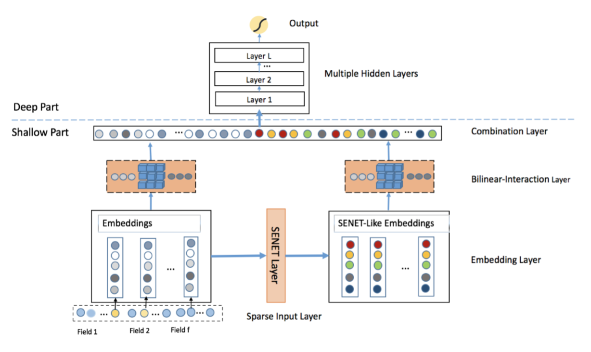

[Huang T, Zhang Z, Zhang J. FiBiNET: Combining Feature Importance and Bilinear feature Interaction for Click-Through Rate Prediction[J]. arXiv preprint arXiv:1905.09433, 2019.](https://arxiv.org/pdf/1905.09433.pdf)

### FLEN(Field-Leveraged Embedding Network)

A large-scale CTR prediction model with efficient usage of field information to alleviate gradient coupling problem.

[**FLEN Model API**](./deepctr.models.flen.html)  

[FLEN example](https://github.com/shenweichen/DeepCTR/tree/master/examples/run_flen.py)

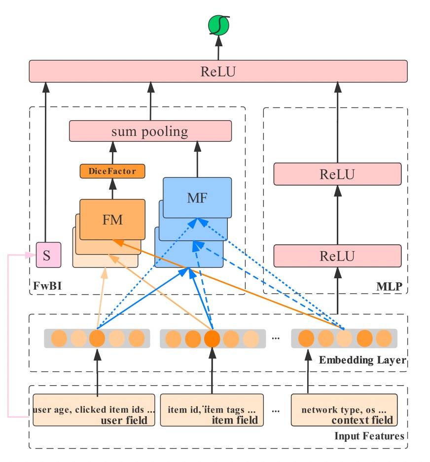

[Chen W, Zhan L, Ci Y, Lin C. FLEN: Leveraging Field for Scalable CTR Prediction[J]. arXiv preprint arXiv:1911.04690, 2019.](https://arxiv.org/pdf/1911.04690.pdf)

## Layers

The models of deepctr are modular,
so you can use different modules to build your own models.

The module is a class that inherits from `tf.keras.layers.Layer`,it has
the same attributes and methods as keras Layers like `tf.keras.layers.Dense()` etc

You can see layers API in [Layers](./Layers.html) 
