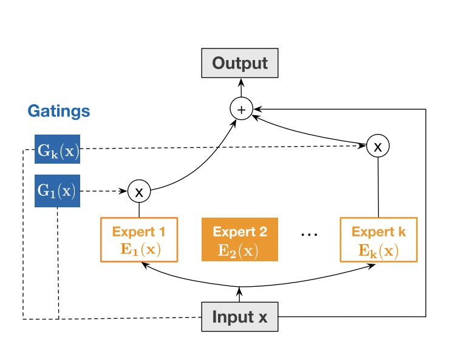
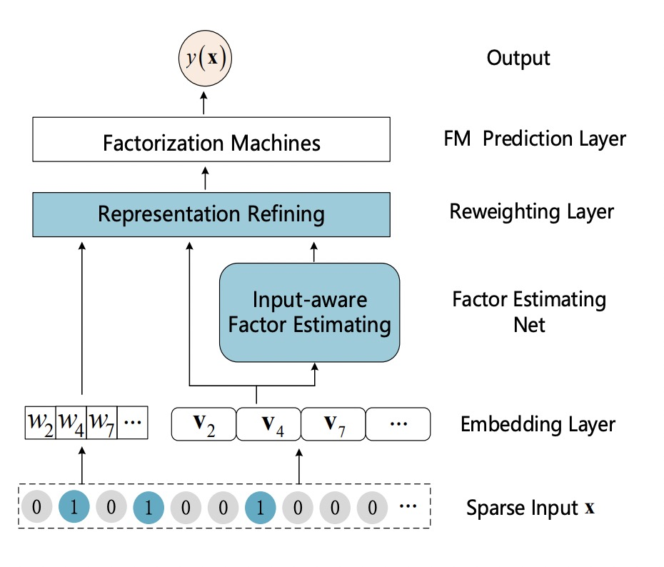
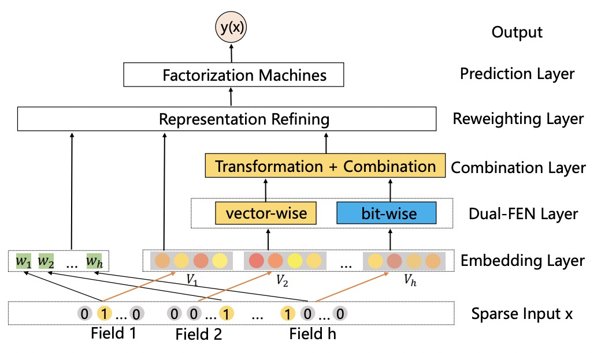
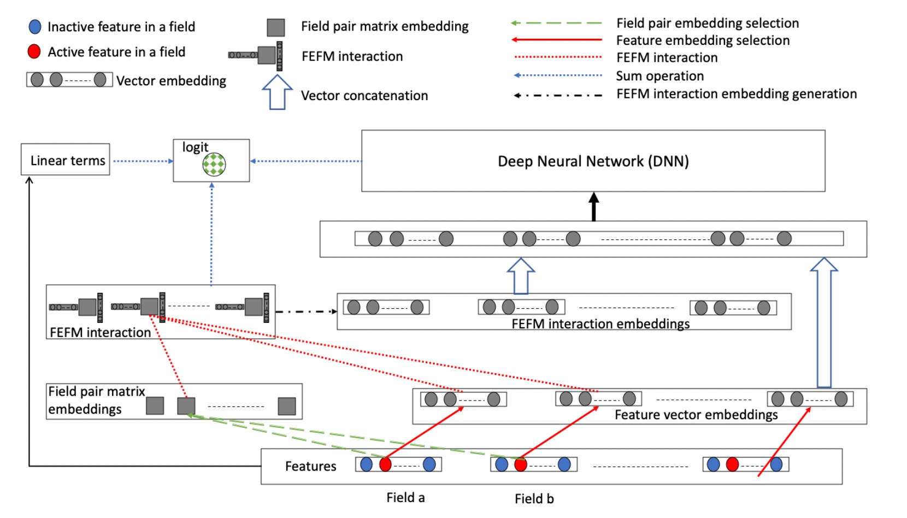
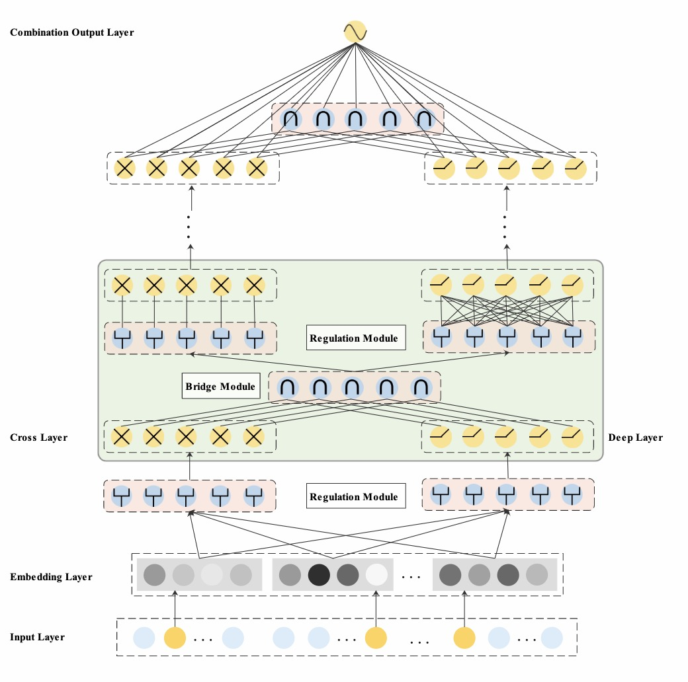
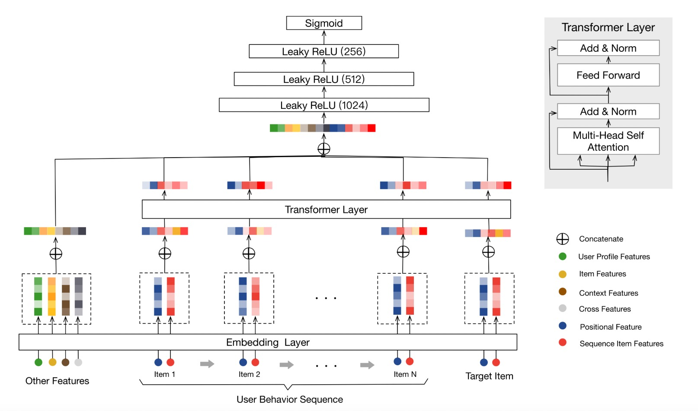
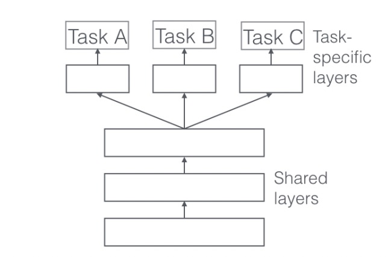
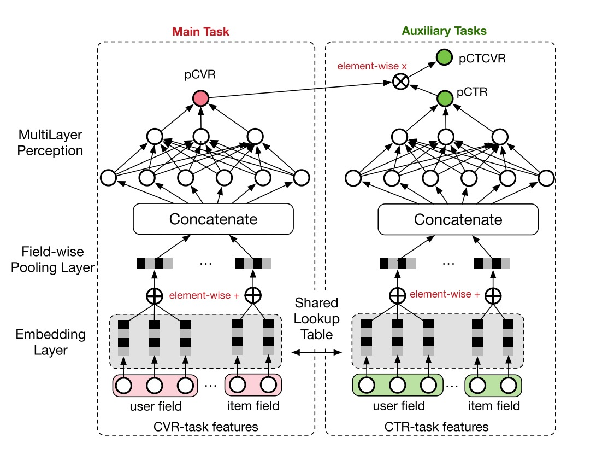
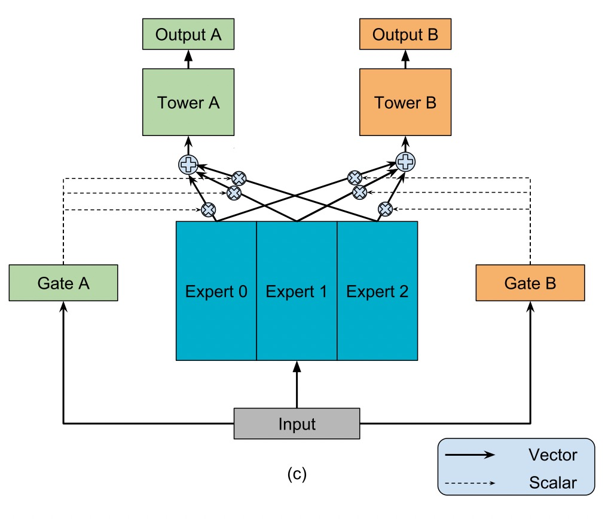

# Features

## Overview

With the great success of deep learning,DNN-based techniques have been widely used in CTR prediction task.

DNN based CTR prediction models usually have following 4 modules:
`Input,Embedding,Low-order&High-order Feature Extractor,Prediction`

- Input&Embedding

> The  data in CTR estimation task  usually includes high sparse,high cardinality categorical features  and some dense numerical features.

> Since DNN are good at handling dense numerical features,we usually map the sparse categorical features to dense numerical through `embedding technique`.

> For numerical features,we usually apply `discretization` or `normalization` on them.

- Feature Extractor

> Low-order Extractor learns feature interaction through  product between vectors.Factorization-Machine and it's variants are widely used to learn the low-order feature interaction.

> High-order Extractor learns feature combination through complex neural network functions like MLP,Cross Net,etc.

## Feature Columns

### SparseFeat

``SparseFeat`` is a namedtuple with
signature ``SparseFeat(name, vocabulary_size, embedding_dim, use_hash, vocabulary_path, dtype, embeddings_initializer, embedding_name, group_name, trainable)``

- name : feature name
- vocabulary_size : number of unique feature values for sparse feature or hashing space when `use_hash=True`
- embedding_dim : embedding dimension
- use_hash : default `False`.If `True` the input will be hashed to space of size `vocabulary_size`.
- vocabulary_path : default `None`. The `CSV` text file path of the vocabulary table used
  by `tf.lookup.TextFileInitializer`, which assigns one entry in the table for each line in the file. One entry contains
  two columns separated by comma, the first is the value column, the second is the key column. The `0` value is reserved
  to use if a key is missing in the table, so hash value need start from `1`.
- dtype : default `int32`.dtype of input tensor.
- embeddings_initializer : initializer for the `embeddings` matrix.
- embedding_name : default `None`. If None, the embedding_name will be same as `name`.
- group_name : feature group of this feature.
- trainable: default `True`.Whether or not the embedding is trainable.

### DenseFeat

``DenseFeat`` is a namedtuple with signature ``DenseFeat(name, dimension, dtype, transform_fn)``

- name : feature name
- dimension : dimension of dense feature vector.
- dtype : default `float32`.dtype of input tensor.
- transform_fn : If not `None` , a function that can be used to transform values of the feature. the function takes the
  input Tensor as its argument, and returns the output Tensor.
  (e.g. `lambda x: (x - 3.0) / 4.2)`.

### VarLenSparseFeat

``VarLenSparseFeat`` is a namedtuple with
signature ``VarLenSparseFeat(sparsefeat, maxlen, combiner, length_name, weight_name,weight_norm)``

- sparsefeat : a instance of `SparseFeat`
- maxlen : maximum length of this feature for all samples
- combiner : pooling method,can be ``sum``,``mean`` or ``max``
- length_name : feature length name,if `None`, value 0 in feature is for padding.
- weight_name : default `None`. If not None, the sequence feature will be multiplyed by the feature whose name
  is `weight_name`.
- weight_norm : default `True`. Whether normalize the weight score or not.

## Models

### CCPM (Convolutional Click Prediction Model)

CCPM can extract local-global key features from an input instance with varied elements, which can be implemented for not
only single ad impression but also sequential ad impression.

[**CCPM Model API**](./deepctr.models.ccpm.html)
[**CCPM Estimator API**](./deepctr.estimator.models.ccpm.html)

[Liu Q, Yu F, Wu S, et al. A convolutional click prediction model[C]//Proceedings of the 24th ACM International on Conference on Information and Knowledge Management. ACM, 2015: 1743-1746.](http://ir.ia.ac.cn/bitstream/173211/12337/1/A%20Convolutional%20Click%20Prediction%20Model.pdf)

### FNN (Factorization-supported Neural Network)

According to the paper,FNN learn embedding vectors of categorical data via pre-trained FM. It use FM's latent vector to
initialiaze the embedding vectors.During the training stage,it concatenates the embedding vectors and feeds them into a
MLP(MultiLayer Perceptron).

[**FNN Model API**](./deepctr.models.fnn.html)
[**FNN Estimator API**](./deepctr.estimator.models.fnn.html)

[Zhang W, Du T, Wang J. Deep learning over multi-field categorical data[C]//European conference on information retrieval. Springer, Cham, 2016: 45-57.](https://arxiv.org/pdf/1601.02376.pdf)

### PNN (Product-based Neural Network)

PNN concatenates sparse feature embeddings and the product between embedding vectors as the input of MLP.

[**PNN Model API**](./deepctr.models.pnn.html)
[**PNN Estimator API**](./deepctr.estimator.models.pnn.html)

[Qu Y, Cai H, Ren K, et al. Product-based neural networks for user response prediction[C]//Data Mining (ICDM), 2016 IEEE 16th International Conference on. IEEE, 2016: 1149-1154.](https://arxiv.org/pdf/1611.00144.pdf)

### Wide & Deep

WDL's deep part concatenates sparse feature embeddings as the input of MLP,the wide part use handcrafted feature as
input. The logits of deep part and wide part are added to get the prediction probability.

[**WDL Model API**](./deepctr.models.wdl.html)
[**WDL Estimator API**](./deepctr.estimator.models.wdl.html)

[Cheng H T, Koc L, Harmsen J, et al. Wide & deep learning for recommender systems[C]//Proceedings of the 1st Workshop on Deep Learning for Recommender Systems. ACM, 2016: 7-10.](https://arxiv.org/pdf/1606.07792.pdf)

### DeepFM

DeepFM can be seen as an improvement of WDL and FNN.Compared with WDL,DeepFM use FM instead of LR in the wide part and
use concatenation of embedding vectors as the input of MLP in the deep part. Compared with FNN,the embedding vector of
FM and input to MLP are same. And they do not need a FM pretrained vector to initialiaze,they are learned end2end.

[**DeepFM Model API**](./deepctr.models.deepfm.html)
[**DeepFM Estimator API**](./deepctr.estimator.models.deepfm.html)

[Guo H, Tang R, Ye Y, et al. Deepfm: a factorization-machine based neural network for ctr prediction[J]. arXiv preprint arXiv:1703.04247, 2017.](http://www.ijcai.org/proceedings/2017/0239.pdf)

### MLR(Mixed Logistic Regression/Piece-wise Linear Model)

MLR can be viewed as a combination of $2m$ LR model, $m$ is the piece(region) number. $m$ LR model learns the weight
that the sample belong to each region,another m LR model learn sample's click probability in the region. Finally,the
sample's CTR is a weighted sum of each region's click probability.Notice the weight is normalized weight.

[**MLR Model API**](./deepctr.models.mlr.html)

[Gai K, Zhu X, Li H, et al. Learning Piece-wise Linear Models from Large Scale Data for Ad Click Prediction[J]. arXiv preprint arXiv:1704.05194, 2017.](http://arxiv.org/abs/1704.05194)

### NFM (Neural Factorization Machine)

NFM use a bi-interaction pooling layer to learn feature interaction between embedding vectors and compress the result
into a singe vector which has the same size as a single embedding vector. And then fed it into a MLP.The output logit of
MLP and the output logit of linear part are added to get the prediction probability.

[**NFM Model API**](./deepctr.models.nfm.html)
[**NFM Estimator API**](./deepctr.estimator.models.nfm.html)

[He X, Chua T S. Neural factorization machines for sparse predictive analytics[C]//Proceedings of the 40th International ACM SIGIR conference on Research and Development in Information Retrieval. ACM, 2017: 355-364.](https://arxiv.org/pdf/1708.05027.pdf)

### AFM (Attentional Factorization Machine)

AFM is a variant of FM,tradional FM sums the inner product of embedding vector uniformly. AFM can be seen as weighted
sum of feature interactions.The weight is learned by a small MLP.

[**AFM Model API**](./deepctr.models.afm.html)
[**AFM Estimator API**](./deepctr.estimator.models.afm.html)

[Xiao J, Ye H, He X, et al. Attentional factorization machines: Learning the weight of feature interactions via attention networks[J]. arXiv preprint arXiv:1708.04617, 2017.](http://www.ijcai.org/proceedings/2017/435)

### DCN (Deep & Cross Network)

DCN use a Cross Net to learn both low and high order feature interaction explicitly,and use a MLP to learn feature
interaction implicitly. The output of Cross Net and MLP are concatenated.The concatenated vector are feed into one fully
connected layer to get the prediction probability.

[**DCN Model API**](./deepctr.models.dcn.html)
[**DCN Estimator API**](./deepctr.estimator.models.dcn.html)

[Wang R, Fu B, Fu G, et al. Deep & cross network for ad click predictions[C]//Proceedings of the ADKDD'17. ACM, 2017: 12.](https://arxiv.org/abs/1708.05123)

### DCN-Mix (Improved Deep & Cross Network with mix of experts and matrix kernel)

DCN-Mix uses a matrix kernel instead of vector kernel in CrossNet compared with DCN,and it uses mixture of experts to
learn feature interactions.

[**DCN-Mix Model API**](./deepctr.models.dcnmix.html)

[Wang R, Shivanna R, Cheng D Z, et al. DCN V2: Improved Deep & Cross Network and Practical Lessons for Web-scale Learning to Rank Systems[J]. arXiv preprint arXiv:2008.13535, 2020.
](https://arxiv.org/abs/2008.13535)

### xDeepFM

xDeepFM use a Compressed Interaction Network (CIN) to learn both low and high order feature interaction explicitly,and
use a MLP to learn feature interaction implicitly. In each layer of CIN,first compute outer products between $x^k$ and
$x_0$ to get a tensor $Z_{k+1}$,then use a 1DConv to learn feature maps $H_{k+1}$ on this tensor. Finally,apply sum
pooling on all the feature maps $H_k$ to get one vector.The vector is used to compute the logit that CIN contributes.

[**xDeepFM Model API**](./deepctr.models.xdeepfm.html)
[**xDeepFM Estimator API**](./deepctr.estimator.models.xdeepfn.html)

[Lian J, Zhou X, Zhang F, et al. xDeepFM: Combining Explicit and Implicit Feature Interactions for Recommender Systems[J]. arXiv preprint arXiv:1803.05170, 2018.](https://arxiv.org/pdf/1803.05170.pdf)

### AutoInt(Automatic Feature Interaction)

AutoInt use a interacting layer to model the interactions between different features. Within each interacting layer,
each feature is allowed to interact with all the other features and is able to automatically identify relevant features
to form meaningful higher-order features via the multi-head attention mechanism. By stacking multiple interacting
layers,AutoInt is able to model different orders of feature interactions.

[**AutoInt Model API**](./deepctr.models.autoint.html)
[**AutoInt Estimator API**](./deepctr.estimator.models.autoint.html)

[Song W, Shi C, Xiao Z, et al. Autoint: Automatic feature interaction learning via self-attentive neural networks[C]//Proceedings of the 28th ACM International Conference on Information and Knowledge Management. 2019: 1161-1170.
](https://arxiv.org/abs/1810.11921)

### ONN(Operation-aware Neural Networks for User Response Prediction)

ONN models second order feature interactions like like FFM and preserves second-order interaction information as much as
possible.Further more,deep neural network is used to learn higher-ordered feature interactions.

[**ONN Model API**](./deepctr.models.onn.html)

[Yang Y, Xu B, Shen F, et al. Operation-aware Neural Networks for User Response Prediction[J]. arXiv preprint arXiv:1904.12579, 2019.](https://arxiv.org/pdf/1904.12579.pdf)

### FGCNN(Feature Generation by Convolutional Neural Network)

FGCNN models with two components: Feature Generation and Deep Classifier. Feature Generation leverages the strength of
CNN to generate local patterns and recombine them to generate new features. Deep Classifier adopts the structure of IPNN
to learn interactions from the augmented feature space.

[**FGCNN Model API**](./deepctr.models.fgcnn.html)

[Liu B, Tang R, Chen Y, et al. Feature Generation by Convolutional Neural Network for Click-Through Rate Prediction[J]. arXiv preprint arXiv:1904.04447, 2019.](https://arxiv.org/pdf/1904.04447)

### FiBiNET(Feature Importance and Bilinear feature Interaction NETwork)

Feature Importance and Bilinear feature Interaction NETwork is proposed to dynamically learn the feature importance and
fine-grained feature interactions. On the one hand, the FiBiNET can dynamically learn the importance of fea- tures via
the Squeeze-Excitation network (SENET) mechanism; on the other hand, it is able to effectively learn the feature
interactions via bilinear function.

[**FiBiNET Model API**](./deepctr.models.fibinet.html)
[**FiBiNET Estimator API**](./deepctr.estimator.models.fibinet.html)

[Huang T, Zhang Z, Zhang J. FiBiNET: Combining Feature Importance and Bilinear feature Interaction for Click-Through Rate Prediction[J]. arXiv preprint arXiv:1905.09433, 2019.](https://arxiv.org/pdf/1905.09433.pdf)

### FLEN(Field-Leveraged Embedding Network)

A large-scale CTR prediction model with efficient usage of field information to alleviate gradient coupling problem.

[**FLEN Model API**](./deepctr.models.flen.html)

[FLEN example](https://github.com/shenweichen/DeepCTR/tree/master/examples/run_flen.py)

[Chen W, Zhan L, Ci Y, Lin C. FLEN: Leveraging Field for Scalable CTR Prediction[J]. arXiv preprint arXiv:1911.04690, 2019.](https://arxiv.org/pdf/1911.04690.pdf)

### IFM(Input-aware Factorization Machine)

IFM improves FMs by explicitly considering the impact of each individual input upon the representation of features,
which learns a unique input-aware factor for the same feature in different instances via a neural network.

[**IFM Model API**](./deepctr.models.ifm.html)

[Yu Y, Wang Z, Yuan B. An Input-aware Factorization Machine for Sparse Prediction[C]//IJCAI. 2019: 1466-1472.](https://www.ijcai.org/Proceedings/2019/0203.pdf)

### DIFM(Dual Input-aware Factorization Machine)

Dual Input-aware Factorization Machines (DIFMs) can adaptively reweight the original feature representations at the
bit-wise and vector-wise levels simultaneously.
[**DIFM Model API**](./deepctr.models.difm.html)

[Lu W, Yu Y, Chang Y, et al. A Dual Input-aware Factorization Machine for CTR Prediction[C]//IJCAI. 2020: 3139-3145.](https://www.ijcai.org/Proceedings/2020/0434.pdf)

### DeepFEFM(Deep Field-Embedded Factorization Machine)

FEFM learns symmetric matrix embeddings for each field pair along with the usual single vector embeddings for each
feature. FEFM has significantly lower model complexity than FFM and roughly the same complexity as FwFM.
[**DeepFEFM Model API**](./deepctr.models.deepfefm.html)

[Pande H. Field-Embedded Factorization Machines for Click-through rate prediction[J]. arXiv preprint arXiv:2009.09931, 2020.](https://arxiv.org/pdf/2009.09931)

### EDCN(Enhancing Explicit and Implicit Feature Interactions DCN)

EDCN introduces two advanced modules, namelybridge moduleandregulation module, which work collaboratively tocapture the layer-wise interactive signals and learn discriminativefeature distributions for each hidden layer of the parallel networks.

[**EDCN Model API**](./deepctr.models.edcn.html)

[Chen B, Wang Y, Liu Z, et al. Enhancing explicit and implicit feature interactions via information sharing for parallel deep ctr models[C]//Proceedings of the 30th ACM International Conference on Information & Knowledge Management. 2021: 3757-3766.](https://dlp-kdd.github.io/assets/pdf/DLP-KDD_2021_paper_12.pdf)

## Sequence Models

### DIN (Deep Interest Network)

DIN introduce a attention method to learn from sequence(multi-valued) feature. Tradional method usually use sum/mean
pooling on sequence feature. DIN use a local activation unit to get the activation score between candidate item and
history items. User's interest are represented by weighted sum of user behaviors. user's interest vector and other
embedding vectors are concatenated and fed into a MLP to get the prediction.

[**DIN Model API**](./deepctr.models.sequence.din.html)

[DIN example](https://github.com/shenweichen/DeepCTR/tree/master/examples/run_din.py)

[Zhou G, Zhu X, Song C, et al. Deep interest network for click-through rate prediction[C]//Proceedings of the 24th ACM SIGKDD International Conference on Knowledge Discovery & Data Mining. ACM, 2018: 1059-1068.](https://arxiv.org/pdf/1706.06978.pdf)

### DIEN (Deep Interest Evolution Network)

Deep Interest Evolution Network (DIEN) uses interest extractor layer to capture temporal interests from history behavior
sequence. At this layer, an auxiliary loss is proposed to supervise interest extracting at each step. As user interests
are diverse, especially in the e-commerce system, interest evolving layer is proposed to capture interest evolving
process that is relative to the target item. At interest evolving layer, attention mechanism is embedded into the
sequential structure novelly, and the effects of relative interests are strengthened during interest evolution.

[**DIEN Model API**](./deepctr.models.sequence.dien.html)

[DIEN example](https://github.com/shenweichen/DeepCTR/tree/master/examples/run_dien.py)

[Zhou G, Mou N, Fan Y, et al. Deep Interest Evolution Network for Click-Through Rate Prediction[J]. arXiv preprint arXiv:1809.03672, 2018.](https://arxiv.org/pdf/1809.03672.pdf)

### DSIN(Deep Session Interest  Network)

Deep Session Interest Network (DSIN) extracts users' multiple historical sessions in their behavior sequences. First it
uses self-attention mechanism with bias encoding to extract users' interests in each session. Then apply Bi-LSTM to
model how users' interests evolve and interact among sessions. Finally, local activation unit is used to adaptively
learn the influences of various session interests on the target item.

[**DSIN Model API**](./deepctr.models.sequence.dsin.html)

[DSIN example](https://github.com/shenweichen/DeepCTR/tree/master/examples/run_dsin.py)

[Feng Y, Lv F, Shen W, et al. Deep Session Interest Network for Click-Through Rate Prediction[J]. arXiv preprint arXiv:1905.06482, 2019.](https://arxiv.org/abs/1905.06482)

### BST(Behavior Sequence Transformer)

BST use the powerful Transformer model to capture the sequential signals underlying users’ behavior sequences .

[**BST Model API**](./deepctr.models.sequence.bst.html)

[BST example](https://github.com/shenweichen/DeepCTR/tree/master/examples/run_din.py)

[Qiwei Chen, Huan Zhao, Wei Li, Pipei Huang, and Wenwu Ou. 2019. Behavior sequence transformer for e-commerce recommendation in Alibaba. In Proceedings of the 1st International Workshop on Deep Learning Practice for High-Dimensional Sparse Data (DLP-KDD '19). Association for Computing Machinery, New York, NY, USA, Article 12, 1–4. DOI:)](https://arxiv.org/pdf/1905.06874.pdf)

## MultiTask Models

### SharedBottom

Hard parameter sharing is the most commonly used approach to MTL in neural networks. It is generally applied by sharing the hidden layers between all tasks, while keeping several task-specific output layers.

[**SharedBottom Model API**](./deepctr.models.multitask.sharedbottom.html)

[Ruder S. An overview of multi-task learning in deep neural networks[J]. arXiv preprint arXiv:1706.05098, 2017.](https://arxiv.org/pdf/1706.05098.pdf)

### ESMM(Entire Space Multi-task Model)

ESMM models CVR in a brand-new perspective by making good use of sequential pattern of user actions, i.e., impression →
click → conversion. The proposed Entire Space Multi-task Model (ESMM) can eliminate the two problems simultaneously by
i) modeling CVR directly over the entire space, ii) employing a feature representation transfer learning strategy.

[**ESMM Model API**](./deepctr.models.multitask.esmm.html)

[Ma X, Zhao L, Huang G, et al. Entire space multi-task model: An effective approach for estimating post-click conversion rate[C]//The 41st International ACM SIGIR Conference on Research & Development in Information Retrieval. 2018.](https://arxiv.org/abs/1804.07931)

### MMOE(Multi-gate Mixture-of-Experts)

Multi-gate Mixture-of-Experts (MMoE) explicitly learns to model task relationships from data. We adapt the Mixture-of-
Experts (MoE) structure to multi-task learning by sharing the expert submodels across all tasks, while also having a
gating network trained to optimize each task.

[**MMOE Model API**](./deepctr.models.multitask.mmoe.html)

[Ma J, Zhao Z, Yi X, et al. Modeling task relationships in multi-task learning with multi-gate mixture-of-experts[C]//Proceedings of the 24th ACM SIGKDD International Conference on Knowledge Discovery & Data Mining. 2018.](https://dl.acm.org/doi/abs/10.1145/3219819.3220007)

### PLE(Progressive Layered Extraction)

PLE separates shared components and task-specific components explicitly and adopts a progressive rout- ing mechanism to
extract and separate deeper semantic knowledge gradually, improving efficiency of joint representation learning and
information routing across tasks in a general setup.

[**PLE Model API**](./deepctr.models.multitask.ple.html)

[Tang H, Liu J, Zhao M, et al. Progressive layered extraction (ple): A novel multi-task learning (mtl) model for personalized recommendations[C]//Fourteenth ACM Conference on Recommender Systems. 2020.](https://dl.acm.org/doi/10.1145/3383313.3412236)

## Layers

The models of deepctr are modular, so you can use different modules to build your own models.

The module is a class that inherits from `tf.keras.layers.Layer`,it has the same attributes and methods as keras Layers
like `tf.keras.layers.Dense()` etc

You can see layers API in [Layers](./Layers.html) 
