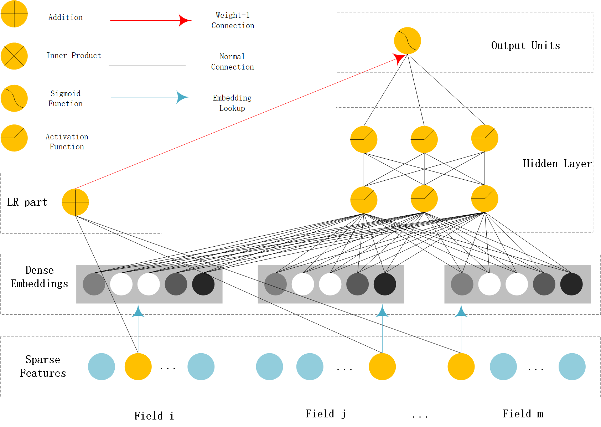
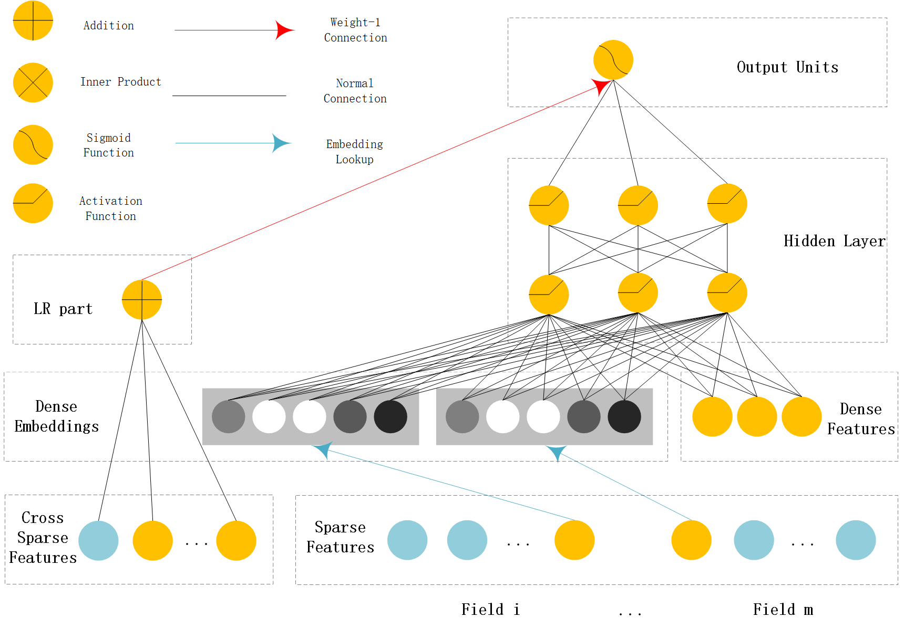
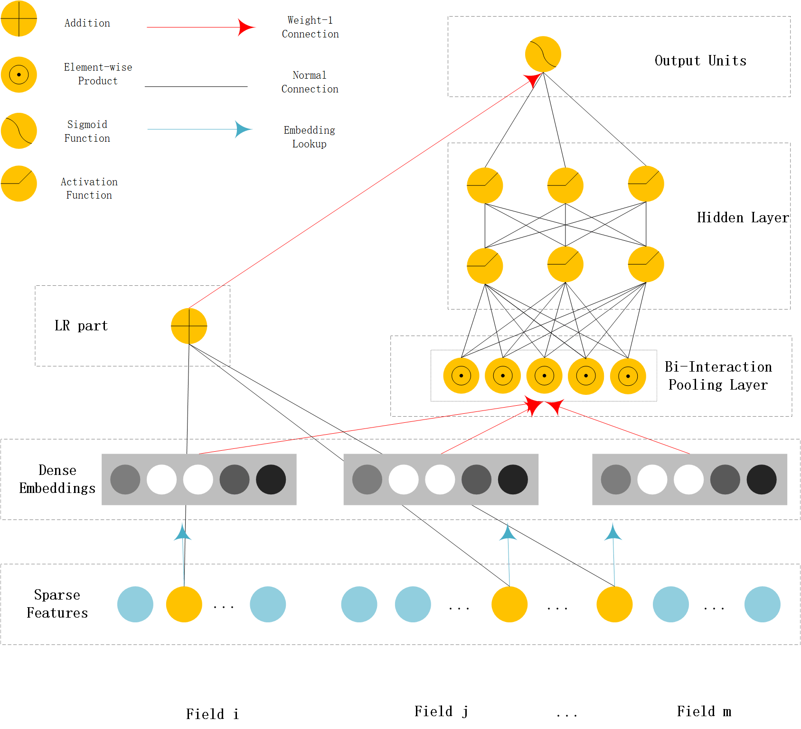

Features
==========

Overview
-----------

With the great success of deep learning,DNN-based techniques have been widely used in CTR estimation task.

DNN based CTR estimation models consists of the following 4 modules:
``Input,Embedding,Low-order&High-order Feature Extractor,Prediction``

Input&Embedding
  The  data in CTR estimation task  usually includes high sparse,high cardinality 
  categorical features  and some dense numerical features.

  Since DNN are good at handling dense numerical features,we usually map the sparse categorical 
  features to dense numerical through `embedding technique`.

  For numerical features,we usually apply `discretization` or `normalization` on them.

Feature Extractor
  Low-order Extractor learns feature interaction through  product between vectors.
  Factorization-Machine and it's variants are widely used to learn the low-order feature interaction.

  High-order Extractor learns feature combination through complex neural network functions like MLP,Cross Net,etc.

Models
--------

FNN (Factorization-supported Neural Network)
>>>>>>>>>>>>>>>>>>>>>>>>>>>>>>>>>>>>>>>>>>>>>>>

According to the paper,FNN learn embedding vectors of categorical data via pre-trained FM.
It use FM's latent vector to initialiaze the embedding vectors.During the training stage,it 
concatenates the embedding vectors and feeds them into a MLP(MultiLayer Perceptron). 

**FNN api** `link <./deepctr.models.fnn.html>`_

Zhang, Weinan, Tianming Du, and Jun Wang. `"Deep learning over multi-field categorical data." <https://arxiv.org/pdf/1601.02376.pdf>`_ European conference on information retrieval. Springer, Cham, 2016.

PNN (Product-based Neural Network)
>>>>>>>>>>>>>>>>>>>>>>>>>>>>>>>>>>>>

PNN concatenates sparse feature embeddings and the product between  embedding vectors as the input of MLP. 

**PNN api** `link <./deepctr.models.pnn.html>`_

.. image:: ../pics/PNN.png
   :align: center
   :scale: 70 %

Qu, Yanru, et al. `"Product-based neural networks for user response prediction." <https://arxiv.org/pdf/1611.00144.pdf>`_ Data Mining (ICDM), 2016 IEEE 16th International Conference on. IEEE, 2016.

Wide & Deep
>>>>>>>>>>>>>

WDL's deep part concatenates sparse feature embeddings as the input of MLP,the wide part use handcrafted feature as input.
The logits of deep part and wide part are added to get the prediction probability.

**WDL api** `link <./deepctr.models.wdl.html>`_

Cheng, Heng-Tze, et al. `"Wide & deep learning for recommender systems." <https://arxiv.org/pdf/1606.07792.pdf>`_ Proceedings of the 1st Workshop on Deep Learning for Recommender Systems. ACM, 2016.

DeepFM
>>>>>>>>

DeepFM can be seen as an improvement of WDL and FNN.Compared with WDL,DeepFM use
FM instead of LR in the wide part and use concatenation of embedding vectors as the input of MLP in the deep part.
Compared with FNN,the embedding vector of FM and input to MLP are same.
And they do not need a FM pretrained vector to initialiaze,they are learned end2end. 

**DeepFM api** `link <./deepctr.models.deepfm.html>`_

.. image:: ../pics/DeepFM.png
   :align: center
   :scale: 50 %

Guo, Huifeng, et al. `"Deepfm: a factorization-machine based neural network for ctr prediction." <http://www.ijcai.org/proceedings/2017/0239.pdf>`_ arXiv preprint arXiv:1703.04247 (2017).

MLR(Mixed Logistic Regression/Piece-wise Linear Model)
>>>>>>>>>>>>>>>>>>>>>>>>>>>>>>>>>>>>>>>>>>>>>>>>>>>>>>>

MLR can be viewed as a combination of 2*m LR model,m is the piece(region) number.
m LR model learns the weight that the sample belong to each region,another m LR model learn sample's click probability in the region.
Finally,the sample's CTR is a weighted sum of each region's click probability.Notice the weight is normalized weight.

**MLR api** `link <./deepctr.models.mlr.html>`_

.. image:: ../pics/MLR.png
   :align: center
   :scale: 50 %

Gai, Kun, et al. `"Learning Piece-wise Linear Models from Large Scale Data for Ad Click Prediction." <http://arxiv.org/abs/1704.05194>`_ arXiv:1704.05194 (2017).

NFM (Neural Factorization Machine)
>>>>>>>>>>>>>>>>>>>>>>>>>>>>>>>>>>>>

NFM use a bi-interaction pooling layer to learn feature interaction between
embedding vectors and compress the result into a singe vector which has the same size as a single embedding vector.
And then fed it into a MLP.The output logit of MLP and the output logit of linear part are added to get the prediction probability. 

**NFM api** `link <./deepctr.models.nfm.html>`_

He, Xiangnan, and Tat-Seng Chua. `"Neural Factorization Machines for Sparse Predictive Analytics.(2017)." <https://arxiv.org/pdf/1708.05027.pdf>`_ (2017).

AFM (Attentional Factorization Machine)
>>>>>>>>>>>>>>>>>>>>>>>>>>>>>>>>>>>>>>>>>

AFM is a variant of FM,tradional FM sums the inner product of embedding vector uniformly.
AFM can be seen as weighted sum of feature interactions.The weight is learned by a small MLP. 

**AFM api** `link <./deepctr.models.afm.html>`_

.. image:: ../pics/AFM.png
   :align: center
   :scale: 70 %

Xiao, Jun, et al. `"Attentional factorization machines: Learning the weight of feature interactions via attention networks." <http://www.ijcai.org/proceedings/2017/435>`_ arXiv preprint arXiv:1708.04617 (2017).

DCN (Deep & Cross Network)
>>>>>>>>>>>>>>>>>>>>>>>>>>>>

DCN use a Cross Net to learn both low and high order feature interaction explicitly,and use a MLP to learn feature interaction implicitly.
The output of Cross Net and MLP are concatenated.The concatenated vector are fed into one fully connected layer to get the prediction probability. 

**DCN api** `link <./deepctr.models.dcn.html>`_

.. image:: ../pics/DCN.png
   :align: center
   :scale: 70 %

Wang, Ruoxi, et al. `"Deep & cross network for ad click predictions." <https://arxiv.org/abs/1708.05123>`_ Proceedings of the ADKDD'17. ACM, 2017.

DIN (Deep Interest Network)
>>>>>>>>>>>>>>>>>>>>>>>>>>>>>

DIN introduce a attention method to learn from sequence(multi-valued) feature.
Tradional method usually use sum/mean pooling on sequence feature.
DIN use a local activation unit to get the activation score between candidate item and history items.
User's interest are represented by weighted sum of user behaviors.
user's interest vector and other embedding vectors are concatenated and fed into a MLP to get the prediction. 

**DIN api** `link <./deepctr.models.din.html>`_

.. image:: ../pics/DIN.png
   :align: center
   :scale: 70 %

Zhou, Guorui, et al. `"Deep interest network for click-through rate prediction." <https://arxiv.org/pdf/1706.06978.pdf>`_ Proceedings of the 24th ACM SIGKDD International Conference on Knowledge Discovery & Data Mining. ACM, 2018.

Layers
--------

The models of deepctr are modular,
so you can use different modules to build your own models.

The module is a class that inherits from ``tf.keras.layers.Layer``,it has
the same properties and methods as keras Layers like ``tf.keras.layers.Dense()`` etc

You can see layers API in `layers <./deepctr.layers.html>`_ 

Activations
--------------

Some custom activation functions.

You can see activations  API in `activations <./deepctr.activations.html>`_ 

Sequence
----------

The sequence module aims to process variable-length sequence data.

You can see sequences  API in `sequence <./deepctr.sequence.html>`_ 
